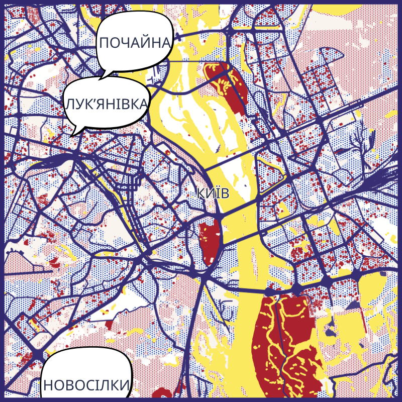

# Map as Roy

Build map as Roy Lichtenstein style.



Ce petit projet pour tester la faisabilité de production de carte à la volée, derrière un mini-site en Python / flask.

Un projet QGis exploite les tuiles vectorielles d'OSM, (voir https://blog.openstreetmap.org/2025/07/22/vector-tiles-are-deployed-on-openstreetmap-org/) et produit une image du lieu choisi, au format JPG, SVG.

L'appel de l'API PyQGis au sein de l'app Flask plante, alors c'est un appel asynchrone au script qui se charge de produire la carte qui est déclenché (subprocess.Popen).

quelques difficultés rencontrées :

- Police de caractères pour les noms de lieux multi-langue\
Ajout de qq fichiers otf, ttf, et QGis se débrouille avec ce bout de code :

```python
    qfontdatabase = QFontDatabase()
    qfontdatabase.addApplicationFont(
        "./resources/fonts/Warung Kopi Light.otf"
    )
```

- 
